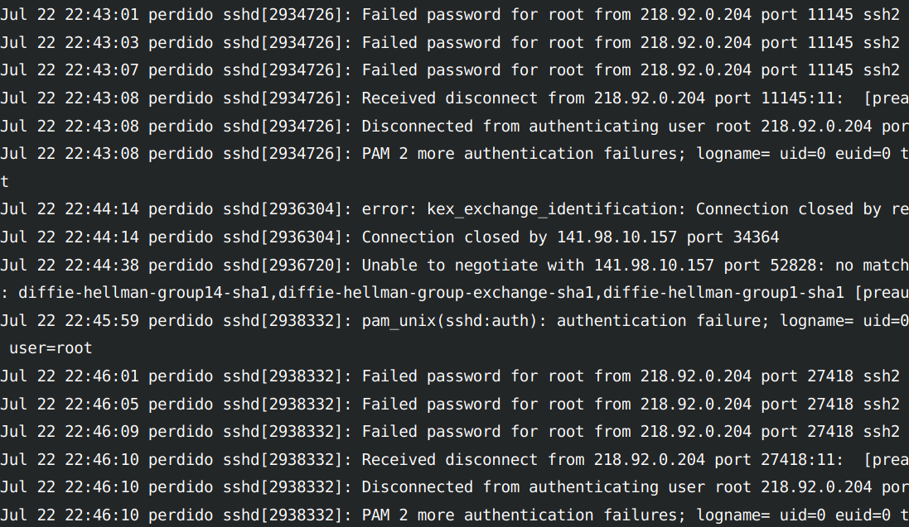

# Perdido

Hi, I'm Perdido. I'm a seedbox, streaming server, and more! I'm really talented.

Here is a list of services I host:

* **For torrenting** I run [rTorrent](https://github.com/rakshasa/rtorrent) (backend) and [ruTorrent](https://github.com/Novik/ruTorrent) (frontend). ruTorrent uses PHP, so I also have that installed. You can connect my to`rTorrent` via SCGI. That lets me use apps like [Transdrone](https://play.google.com/store/apps/details?id=org.transdroid.lite&hl=en&gl=US) to manage it.
* **For auto-sorting downloads** I use my [sweeper](https://github.com/GregRos/sweeper), which is a custom python script. That script uses [filebot](https://www.filebot.net/) behind the scenes in most cases.
* **For video streaming,** I run [Jellyfin](https://github.com/jellyfin/jellyfin).
* **For file transfer,** I support SCP, SFTP, and FTP (TLS only). If none of that works for you, you can use my trusty [filebrowser](https://filebrowser.org/) instead.

To tie this all together I use [nginx](https://nginx.org/), acting as a reverse proxy. Neat, right? I'd show you, but I only show my internal services to my trusted friends who know the secret handshake.

Sadly, ever since I moved in to my neighborhood and started torrenting, I've been getting all kinds of nasty callers. Just look at this page from my journal:



I don't know any of these kiddies! They all just ring my SSH, say `root`, and then run away! A few of them even tried to convince me to use SHA1. How horrid.

More importantly, though - the racket! I could barely sleep. At least, not until I installed [fail2ban](https://www.fail2ban.org/wiki/index.php/Main_Page). And it worked like a charm, just like the testimonials said it would. It really helps keeping the more rambunctious ones at bay. Let's see who's on my naughty list right now:

```
[{'sshd': ['218.92.0.204']}, {'vsftpd': []}]
```

Oh, that's `218.92.0.204` from earlier! I hope they've learned their lesson.

I couldn't stop just with that, though. Sure, `fail2ban` protects by FTP and SSH, but I wanted to be sure my nginx is safe too. So I compiled [ModSecurity](https://github.com/SpiderLabs/ModSecurity) and even got some [rules](https://owasp.org/www-project-modsecurity-core-rule-set/) for it. I hooked that all up and got it purring like a kitten. No nasty HTTP traffic is going to be bothering my nginx.

After all that was done I went out and got an official [LetsEncrypt](https://letsencrypt.org/) certificate. From now on, if someone offers me some unencrypted traffic - I just say no!

# Structure

```bash
- config # text config files for different services
- data # binary files, encrypted files, etc
- installer # python installer code
- scripts # invoked by things after installation
- steps # bash scripts that install all the programs
```

# Installation

Requires Debian 11 and Python 3.9. All other requirements are installed by the script.

```bash
git clone git@github.com:GregRos/perdido.git /opt/perdido
cd /opt/perdido
./install install
```

Perdido includes a handy CLI for running some of the stages separately. For example:

```
./install run 3,50,docker,51- rtorrent
```

The above would only run the scripts:

* `03.docker.bash`
* `31.rtorrent.bash`
* `50.ftp.bash`
* Scripts with ID `51+`.

It will still run them in ascending order, not in the specified order.

Perdido is not containerized and expects to run on a VM or physical machine.

# Configuration

Some services still need to be configured manually after the installation:

1. Jellyfin
2. Filebrowser
3. Maybe other stuff.

Perdido is not a shrinkwrapped application, it's a cobbled-together bundle of code. Maybe one day it'll all be k8s pods or something.


